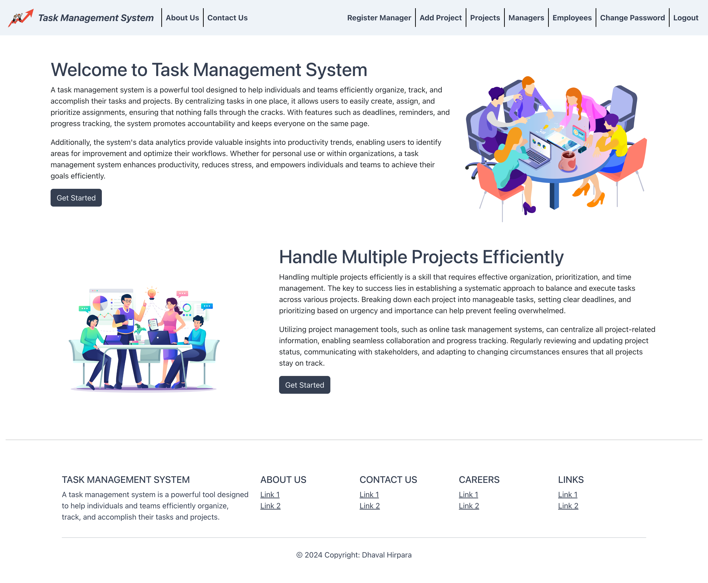
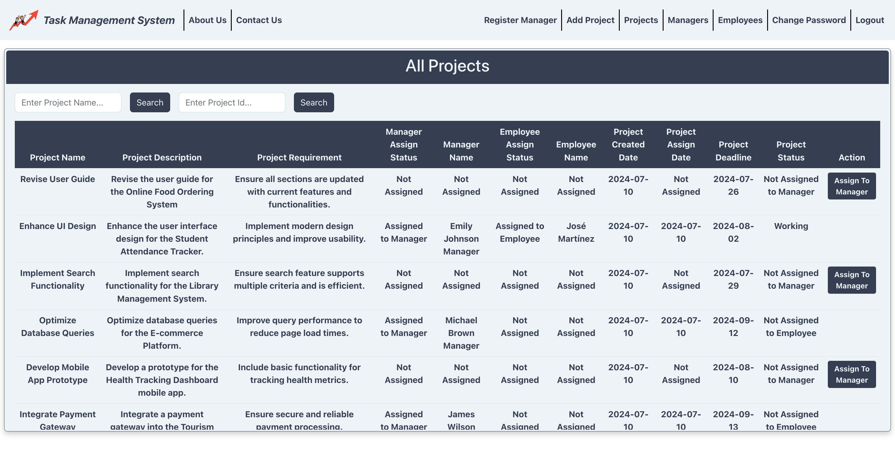

# Jira Lite: Simplifying Collaboration, Amplifying Productivity

<p align="center">
  
</p>

<p align="center">
  <strong>Efficient Task Management for Teams of All Sizes</strong>
</p>

<p align="center">
  <a href="#key-features">Key Features</a> •
  <a href="#tech-stack">Tech Stack</a> •
  <a href="#installation">Installation</a> •
  <a href="#usage">Usage</a> •
  <a href="#screenshots">Screenshots</a> •
  <a href="#future-enhancements">Future Enhancements</a> •
  <a href="#license">License</a>
</p>

## Key Features

- **Multi-Role System**: Administrator, Project Manager, and Employee roles
- **Project Oversight**: Comprehensive management for Administrators
- **Task Assignment**: Efficient task allocation for Project Managers
- **Progress Tracking**: Real-time updates on project status
- **User-Friendly Interface**: Intuitive design for seamless navigation
- **Secure Authentication**: Password management for all users

## Tech Stack

- **Frontend**: React, Bootstrap
- **Backend**: Spring Boot
- **Database**: MySQL
- **Tools**: Maven, MySQL Workbench

## Installation

1. Clone the repository
   ```
   git clone https://github.com/dhaval-hirpara/jira-lite.git
   ```
2. Install frontend dependencies
   ```
   cd frontend
   npm install
   ```
3. Install backend dependencies
   ```
   cd backend
   mvn install
   ```
4. Set up MySQL database
5. Configure application properties

## Usage

1. Start the backend server
   ```
   cd backend
   mvn spring-boot:run
   ```
2. Start the frontend application
   ```
   cd frontend
   npm start
   ```
3. Access the application at `http://localhost:3000`

## Screenshots

<p align="center">
  
</p>
<p align="center">
  
</p>

## Future Enhancements

- Sub-task division
- Real-time notification system
- Rich text formatting and document attachments
- Team management features

## License

This project is licensed under the MIT License - see the [LICENSE.md](LICENSE.md) file for details.

---

<p align="center">
  Developed with ❤️ by <a href="https://github.com/dhaval-hirpara">Dhaval Hirpara</a>
</p>
